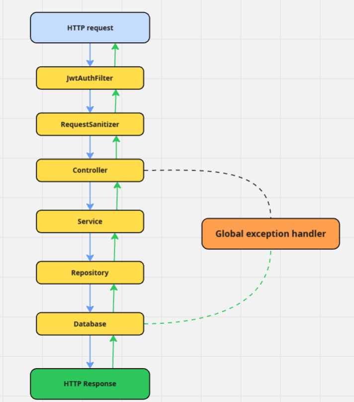

# Book Review API

Book Review API je REST aplikacija razvijena u Spring Boot-u, koja implementira slojevitu arhitekturu sa JWT autentikacijom, validacijom i centralizovanim rukovanjem greškama.
Projekat demonstrira principe čiste arhitekture, jasne separacije odgovornosti i dobrih praksi u dizajnu API-ja.

### Pregled Endpoint metoda: Pokrenuti BookReviewApplication i onda otići na http://localhost:8080/swagger-ui.html

## 📁 Struktura projekta
Aplikacija koristi slojevitu arhitekturu, sa sledećim logičkim paketima:
```python
com.example.bookreview
BookReviewAPI/
├── pom.xml                          # Maven build fajl (zavisnosti i konfiguracija)
└── src/
    ├── main/
    │   ├── java/com/example/bookreview/
    │   │   ├── BookReviewApplication.java      # Ulazna tačka Spring Boot aplikacije
    │   │   │
    │   │   ├── controller/                     # REST kontroleri
    │   │   │   ├── BookController.java
    │   │   │   └── BookReviewController.java
    │   │   │
    │   │   ├── service/                        # Poslovna logika
    │   │   │   ├── BookService.java
    │   │   │   └── BookReviewService.java
    │   │   │
    │   │   ├── repository/                     # Pristup bazi (Spring Data JPA)
    │   │   │   ├── BookRepository.java
    │   │   │   └── BookReviewRepository.java
    │   │   │
    │   │   ├── model/                          # JPA entiteti
    │   │   │   ├── ApiResponse.java
    │   │   │   └── BookReview.java
    │   │   │
    │   │   ├── DTO/                          # DTO objekti
    │   │   │   ├── BookReviewUpdateDTO.java
    │   │   │   └── BookSearchParams.java
    │   │   │
    │   │   ├── exception/                      # Prilagođeni izuzeci
    │   │   │   ├── GlobalExceptionHandler.java
    │   │   │   ├── AbstractApiException.java
    │   │   │   ├── ResourceNotFoundException.java
    │   │   │   └── UnauthorizedException.java
    │   │   │
    │   │   ├── utils/                       
    │   │   │   └── JWTUtil.java                # JWT utils klasa za generisanje tokena
    │   │   │
    │   │   ├── security/                       # JWT autentikacija i validacija parametara
    │   │   │   ├── JwtAuthFilter.java
    │   │   │   ├── JWTUtil.java
    │   │   │   └── RequestSanitizer.java
    │   │   │
    │   │   └── config/                         # Konfiguracija filtera i interceptora
    │   │       ├── FilterConfig.java
    │   │       └── WebConfig.java
    │   │
    │   └── resources/
    │       └── application.properties          # Konfiguracija baze i aplikacije
    │
    └── test/groovy/                            # Primer strukture Groovy testova
        └── com/example/bookreview/
            └── ExampleSpec.groovy
```


## Paketi i slojevi
### 1. Controller sloj
Rukuje HTTP zahtevima i prosleđuje ih servisima.
Ne sadrži poslovnu logiku.

**BookController**

* **POST /books** — kreira novu knjigu

* **GET /books** — vraća sve knjige ili jednu preko ?id={id}

* **GET /books/search** — pretraga po naslovu i autoru

* **GET /books/stats** — vraća agregirane podatke o knjigama

* **DELETE /books?id={id}** — briše knjigu

---

**BookReviewController**

* **POST /reviews** — dodaje recenziju

* **GET /reviews?bookId={id}** — vraća recenzije za knjigu

* **PUT /reviews/update?id={id}** — ažurira recenziju

* **DELETE /reviews?id={id}** — briše recenziju


### 2. Service sloj
Implementira poslovnu logiku i validaciju.

**BookService**

* Validira postojanje knjige pre ažuriranja ili brisanja

* Poziva repozitorijum i baca ResourceNotFoundException ako entitet ne postoji

**BookReviewService**

* Validira postojanje recenzije

* Baca ResourceNotFoundException ako recenzija ne postoji

* Rukuje dodavanjem i ažuriranjem sadržaja

### 3. Repository sloj

Omogućava pristup bazi podataka pomoću Spring Data JPA.

**BookRepository**

* Nasleđuje JpaRepository<Book, Long>

* Sadrži prilagođenu @Query metodu s kojom se pretražuju knjige

**BookReviewRepository**

* Standardne CRUD operacije nad BookReview entitetom.

### 4. Model sloj

* Sadrži JPA entitete sa validacijom. (**Book**, **BookReview**)

### 5. Exception sloj 
Centralizovano rukovanje greškama kroz **@RestControllerAdvice**.

**GlobalExceptionHandler**

Hvata i formatira sve izuzetke u JSON obliku:

* **MethodArgumentNotValidException** — validacija tela zahteva

* **ConstraintViolationException** — validacija parametara

* **MissingServletRequestParameterException** — nedostajući query parametar

* **MethodArgumentTypeMismatchException** — pogrešan tip parametra

* **HttpMessageNotReadableException** — loš JSON zahtev

* **AbstractApiException** — prilagođene greške

* **Exception** — fallback za neočekivane slučajeve

### 6. Security sloj

Bezbednosni mehanizmi i provera JWT tokena.

**JwtAuthFilter**

* Nasleđuje OncePerRequestFilter

* Čita Authorization header i validira token

* Baca UnauthorizedException ako token ne postoji ili je nevažeći


**RequestSanitizer**

* Interceptor koji proverava dozvoljene query parametre za svaku rutu.

### 7. Config sloj
Sadrži konfiguracije aplikacije.

**FilterConfig**

* Registruje JwtAuthFilter za rute /books/* i /reviews/*.

**WebConfig**

* Registruje RequestSanitizer kao HandlerInterceptor.

### Tok HTTP zahteva kroz slojeve


### 8. pom.xml zavisnosti

```python
       [Zavisnost]                                     [Opis]
spring-boot-starter-web	             :            REST i MVC sloj
spring-boot-starter-data-jpa         :            ORM i rad sa bazom
spring-boot-starter-validation       :            Validacija modela
spring-boot-starter-security         :            Autentikacija i filteri
jjwt                                 :            Generisanje i validacija JWT tokena
mysql-connector-j                    :            JDBC drajver za MySQL
lombok                               :            Automatsko generisanje getter/setter metoda
spring-boot-starter-test             :            Testiranje i MockMvc
```


## Author

Uros Djeric!
